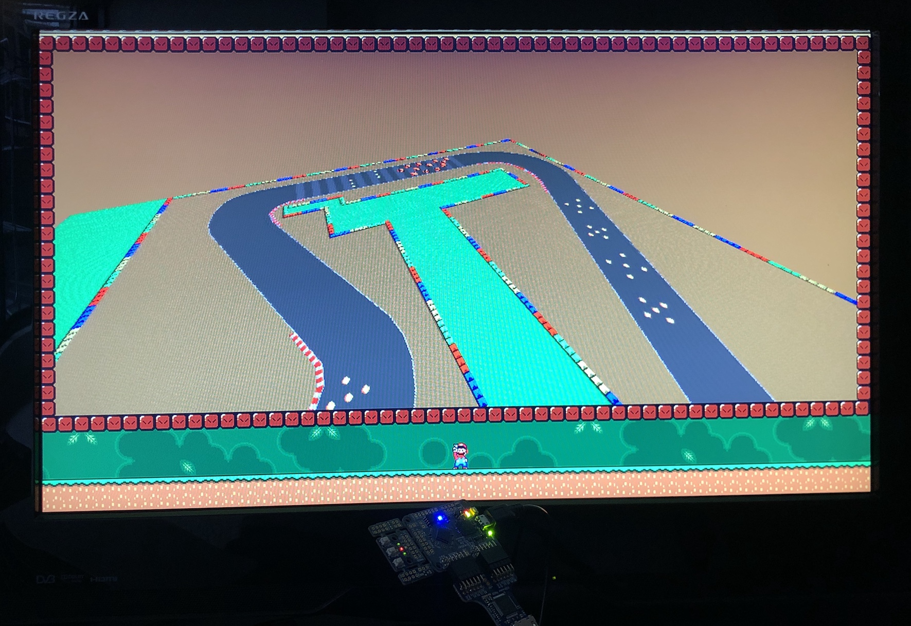

# icestation-32

This is a compact open-source FPGA game console targetting the Lattice iCE40 UltraPlus series. It's being developed using the open-source yosys and nextpnr tools and run on the iCEBreaker FPGA board. It requires the 12bpp HDMI PMOD for video output.

This repo is still in its early stages and its and contents (including this README) are changing rapidly.



## Features

* PicoRV32 main CPU (compact implementation of RISC-V)
* 64kbyte of CPU RAM (2x SPRAM)
* Custom VDP for scrolling layers and sprites
* 64kbyte VDP RAM (2x SPRAM)
* Configurable video modes of 640x480@60hz or 848x480@60hz
* 4bpp graphics assembled from 8x8 tiles
* ARGB16 colors arranged into 16 palettes of 16 colors each
* Optional alpha blending using 4bit alpha intensity**
* 4x scrolling layers up to 1024x512 pixels each*
* 1x 1024x1024 pixel affine-transformable layer*
* 256x sprites of up to 16x16 pixels each
* 1060+ sprite pixels per line depending on clock and video mode

*Only one of these layer types can be enabled at any given time but they can be toggled multiple times in a frame using raster-timed updates.

**Visual artefacts can been seen if more than one alpha-enabled layer intersects with another i.e. using overlapping sprites.

## Usage

### Prerequisites

* yosys
* nextpnr-ice40
* icetools
* GNU RISC-V toolchain (newlib)

While the RISC-V toolchain can be built from source, the PicoRV32 repo [includes a Makefile](https://github.com/cliffordwolf/picorv32#building-a-pure-rv32i-toolchain) with convenient build-and-install targets. This project only uses the `RV32I` ISA. Those with case-insensitive file systems will likely have issues building the toolchain from source. If so, binaries of the toolchain for various platforms are available [here](https://github.com/xpack-dev-tools/riscv-none-embed-gcc-xpack/releases/tag/v8.3.0-1.1).

### Programming bitstream on iCEBreaker

```
cd hardware
make prog
```

### Programming software on iCEBreaker

Demo software is included under `/software` and can be programmed separately. For example, to build and program the `sprites` demo:

```
cd software/sprites/
make
iceprog -o 1M prog.bin
```

### Running simulator (Verilator or CXXRTL, plus SDL2)

A simulator using SDL2 and its documentation is included in the [/simulator](simulator/) directory.

Demo software and simulator screenshots are included in the [/software](software/) directory.

## TODO

* A better README file!
* Explanation of 1x and 2x clock modes and their necessity
* More demo software for sprites / scrolling layers / raster effects etc.
* Re-adding the 3x layer, non-interleaved scrolling layers for more efficient VRAM usage and to reduce LC usage
* Many bits of cleanup and optimization
* Gamepad support, when the PMODs become available
* Audio

