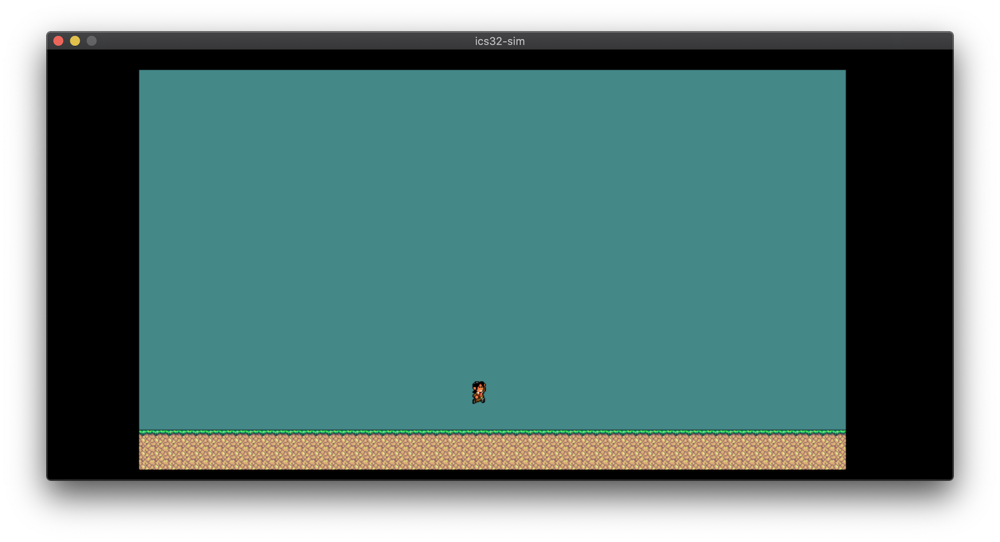
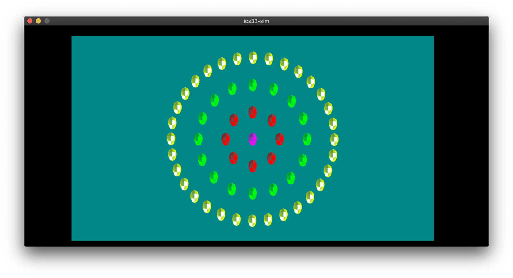

# Demo software

## Prerequisites

* GNU RISC-V toolchain

The `CROSS` variable in `common/common.mk` must be set according to the name of your RISC-V installation.

## Simulation

`cd` into any demo directory and run `make sim`. This will:

1. Build the demo software
2. Build the simulator
3. Launch the demo in the simulator

## `copper_polygon/`

Copper coprocessor demo using horizontal raster effects to draw a rotated, scaled polygon. The copper has a simple instruction set dedicated to performing raster-synced writes to the VDP. The CPU transforms a polygon each frame, traces its edges, then emits copper machine code used to toggle the display of a static opaque layer. The effective result is a layer mask in the shape of the transformed polygon.

The copper is implemented in vdp_copper.v and has 4kbyte of instruction memory.

## `platformer/`

Controllable character sprite that can walk and jump with simple physics on a static playfield. This uses the gamepad interface which is currently mocked using the 3 buttons on the iCEBreaker.

## `sprites/`

Animated sprites demo. A palette-based PNG file is converted to the ics-32 format and compiled into the demo. This demo also shows alpha blending of sprites onto a variable backgroud color.

## `hello_world/`

Minimal example using a single scrolling layer to display monochrome text.

## Other demos

(Twitter)

## Acknowledgements

* [Rotating crystal graphics](https://opengameart.org/content/rotating-crystal-animation-8-step) by qubodup
* [8x8 font](https://github.com/dhepper/font8x8) by dhepper
* [Super Miyamoto spritesheet](https://opengameart.org/content/super-miyamoto) by Lars Doucet & Sean Choate. Minor modifications were made for the `platformer` demo.
* [Super Mario World Redrawn](https://www.romhacking.net/hacks/2919/) game mod by IceGoom
